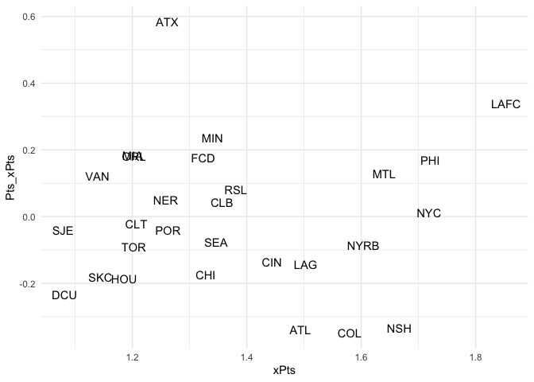
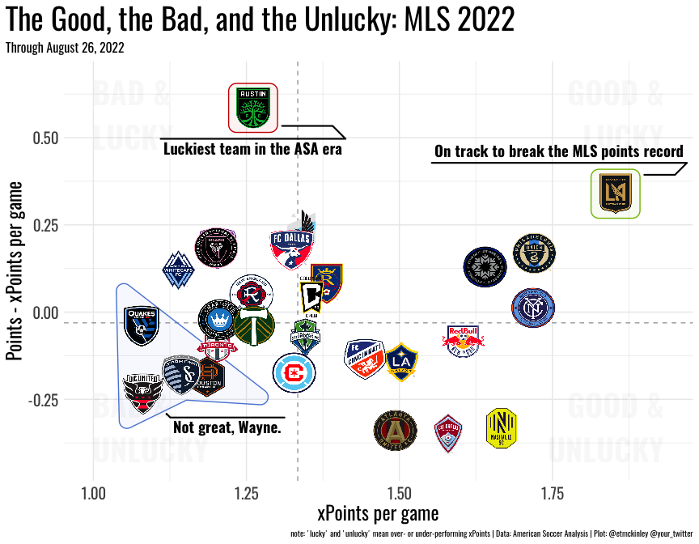

Making a Good/Lucky Matrix
================
Eliot McKinley

## The Good/Lucky Matrix

The Good/Lucky matrix tells you about which teams have been good in a
single season (based upon expected points) and whether a team has been
lucky with their results (based upon over- or under- performing their
underlying expected points). While I use the term “lucky” here, a team
over- or under-performing their expected points in not simply just due
to chance. There are multiple factors that can allow a team to generate
more or less points than expected such as game states, styles of play
that xG doesn’t quite capture well, and others in addition to just being
fortunate or unfortunate.

In this tutorial we will be getting data from [American Soccer
Analysis](https://www.americansocceranalysis.com/) using the package
[{itscalledsoccer}](https://github.com/American-Soccer-Analysis/itscalledsoccer)
to get the same data you could get using the [American Soccer Analysis
app](https://app.americansocceranalysis.com/).

For a longer run-down of how the Good/Lucky matrix is made, see [this
article](https://www.americansocceranalysis.com/home/2018/8/14/the-good-the-bad-and-the-unlucky-what-xpoints-tells-us-about-the-2018-mls-season).

## Setting the Stage

First we need to load in the required libraries to grab the data and
generate the plots.

``` r
library(tidyverse)
library(ggsci)
library(ggimage)
library(ggforce)
library(cowplot)
library(itscalledsoccer)
```

Next we have to select what league and season you want to generate a
plot for as well as the size of the final output.

``` r
league_select = "mls"

season_select = 2022

# set final image size
width=9

height =7
```

I maintain a spreadsheet with information about American teams such as
team colors, logos, and twitter handles. We need to read in that
information.

``` r
team_info = read.csv(
  "https://docs.google.com/spreadsheets/d/e/2PACX-1vTiZfW7pSUWPttpHSMlAwgMyXwdAeLAW6HuoHwZa69FrNpfzqVkM_0DaeAveTG7hvbCSK-HBh31QxIM/pub?gid=95813594&single=true&output=csv"
)
```

Finally, we need to initialize a new main class to access the American
Soccer Analysis API (this may take a few seconds).

``` r
asa_client = AmericanSoccerAnalysis$new()
```

      Gathering players......✔ 
      Gathering teams......✔ 
      Gathering stadia......✔ 
      Gathering managers......✔ 
      Gathering referees......✔ 

## Getting and Modifying the Data

Now we can get team xG data from the API. In this case I am splitting by
seasons so it doesn’t aggregate team data across multiple seasons and
also specifying the stages of the season I want to get, in this case I
don’t want data from the playoffs.

``` r
team_data = asa_client$get_team_xgoals(
  leagues = league_select,
  split_by_seasons = TRUE,
  stage_name = c("Regular Season", 'MLS is Back Group Stage')
) 
```

Next we want to add a few columns to this data for each team season:  

1.  xPts = expected points per game

2.  Pts = points per game

3.  Pts_xPts = points - expected points per game (how “lucky” the team
    is)

4.  logo = use the team hash_id to get the url for the team logo

5.  Team = use left_join() with team_info to add the team abbreviation
    to make manual inspection of the data easier. It’s much easier for a
    human to understand that “SJE” is the San Jose Earthquakes than
    “0KPqjA456v” and will make the annotation we do later easier.

``` r
team_data = team_data %>%
  group_by(season_name, team_id) %>%
  mutate(
    xPts = xpoints / count_games,
    Pts = points / count_games,
    Pts_xPts = Pts - xPts,
    logo = paste0(
      "https://app.americansocceranalysis.com/club_logos/",
      team_id,
      ".png"
    ),
  ) %>%
  left_join(team_info %>% select(team_id = team_hashid, Team = team_abbreviation))
```

    Joining, by = "team_id"

## A Quick Look

At this point we can do a quick look at what the matrix will look like
to make sure it makes sense. We’ll only plot the season we selected at
the beginning.

``` r
team_data %>% 
  filter(season_name == season_select) %>% 
  ggplot(aes(x=xPts, y=Pts_xPts))+
  geom_text(aes(label = Team))+
  theme_minimal()
```



## Annotating the Data

This step is optional, but can make it much easier for the audience to
understand what you are trying to say in a chart. Using the chart
generated above you can add annotations to the plot to help direct a
reader.

Again, we are filtering the data only to the season we want to show.
Next we add another column to the data “circles” which will be NA by
default.

Next you can then add annotations for selected teams based upon their
abbreviations.

``` r
team_data_annotate = team_data %>%
  filter(season_name == season_select) %>%
  mutate(
    circles = NA,
    circles = ifelse(Team %in% c("LAFC"), "On track to break the MLS points record", circles),
    circles = ifelse(Team %in% c("SJE", "DCU", "SKC", "HOU"),
                     "Not great, Wayne.",
                     circles),
    circles = ifelse(Team %in% c("ATX"), "Luckiest team in the ASA era", circles)
  ) %>%
  arrange(xPts) 
```

## The Plot

Now that we’ve obtained and annotated the data we can plot it.

First we want to set some sensible limits on the coordinates. This
prevents logos from getting cut off on the edges as well as decreasing
white space on the plot that the auto-limits sometimes causes.

Usually, the automatic limits work well, but in case they don’t you may
have to uncomment and modify the manual limits if things look strange on
your final plot.

``` r
# automatic limits
xlims = c(min(team_data_annotate$xPts) - .08,
          max(team_data_annotate$xPts) + .08)
ylims = c(min(team_data_annotate$Pts_xPts) - .08,
          max(team_data_annotate$Pts_xPts) + .08)

# manual limits
#xlims = c(.85,2)
#ylims = c(-.5,.75)

# create data frame with quadrant labels
quadrant_labels = data.frame(
  label = c(
    "Good &\nLucky",
    "Bad &\nLucky",
    "Good &\nUnlucky",
    "Bad &\nUnlucky"
  ),
  x = c(xlims[2], xlims[1], xlims[2], xlims[1]),
  y = c(ylims[2], ylims[2], ylims[1], ylims[1])
)
```

With the coordinates set, we can finally generate the final plot. A few
notes in case you run into issues:  

1.  I’ve used “Oswald” as my font here. If you don’t have that installed
    on your system you’ll either have to do that or change it to another
    font by replacing all instances of “Oswald” with your chosen font.

2.  Depending on your annotations, the labels from geom_mark_hull() may
    run off the plot or be obscured by the logos. You can either
    manually change the overall plot coordinates,change some of the
    spacing parameters in geom_mark_hull(), or change the annotation
    text to fix this.

3.  The logo aspect ratio may look strange initially. This will be fixed
    when you save the plot in the next step. If it is still an issue,
    you can change the aspect ratio, “asp”, in the geom_image() function
    call.

4.  I automatically generate the subtitle based upon the system date. If
    you are generating this plot for a season that is already completed
    or using data that does not go up to the current data, you’ll want
    to change this.

``` r
p=team_data_annotate %>%
  ggplot(aes(x = xPts, y = Pts_xPts)) +
  # add quadrant labels
  geom_text(
    data = quadrant_labels,
    aes(
      x = x,
      y = y,
      label = toupper(label)
    ),
    family = "Oswald",
    fontface = "bold",
    size = 10,
    color = "black",
    alpha = 0.03,
    hjust = "inward",
    vjust = "inward"
  ) +
  # add lines for meian values
  geom_vline(aes(xintercept = median(xPts)),
             linetype = "dashed",
             alpha = 0.4) +
  geom_hline(aes(yintercept = median(Pts - xPts)),
             linetype = "dashed",
             alpha = 0.4) +
  # add annotations
  geom_mark_hull(
    aes(
      color = circles,
      label = circles,
      fill = circles,
      group = circles,
      filter = !is.na(circles)
    ),
    expand = unit(8, "mm"),
    con.size = 0.75,
    con.cap = unit(1.5, "mm"),
    label.buffer = unit(.1, "mm"),
    label.margin = margin(1, 1, 1, 1, "mm"),
    label.lineheight = 0.9,
    label.family = "Oswald",
    label.fontsize = 14,
    label.fill = "transparent",
    con.border = "one",
    #con.cap = unit(.5, "mm"),
    show.legend = FALSE,
    alpha = 0.05
  ) +
  # add logos
  geom_image(aes(image = logo), size = 0.07, asp = width / height * 1.08) +
  # set color and fill for annotations
  scale_fill_startrek() +
  scale_color_startrek() +
  # set coordinate limits
  coord_cartesian(xlim = xlims, ylim = ylims) +
  # change some theme elements
  theme_minimal() +
  theme(
    text = element_text(size = 18, family = "Oswald"),
    plot.caption = element_text(size = 7.5),
    plot.title = element_text(size = 28),
    plot.subtitle = element_text(size = 12),
    plot.title.position = "plot"
  ) +
  # add some labels
  labs(
    title = "The Good, the Bad, and the Unlucky: MLS 2022",
    subtitle = paste0("Through " , format(Sys.Date(), "%B %d, %Y")) ,
    x = "xPoints per game",
    y = "Points - xPoints per game",
    #x="xPoints",
    #y="Points - xPoints",
    caption = "note: 'lucky' and 'unlucky' mean over- or under-performing xPoints | Data: American Soccer Analysis | Plot: @etmckinley @your_twitter"
  )

p
```



Next, we will add the American Soccer Analysis logo, because it looks
really cool and also indicated where this data is from. This should work
well for a plot that is 9x7, but you may have to change to location if
you change that size.

``` r
m.out = ggdraw(p) +
  draw_image(
    "https://raw.githubusercontent.com/etmckinley/goals_added_wheels/main/asa_icon_light.png",
    x = 0.45,
    y = -.42,
    scale = 0.08
  )
```

Finally, we can save the plot. Note: you will need to change “bg” to the
background color of your plot. Here I use a light theme so it is set to
“white” but if you use another you’ll have to change it. If you do not
set “bg” the background will be transparent, which you may want for
certain uses.

``` r
ggsave(
  plot = m.out,
  paste0("lucky_", Sys.Date(),  ".png"),
  width = width,
  height = height,
  bg = "white"
)
```

## Conclusion

And that’s how to generate a nice looking Good/Lucky matrix using data
from American Soccer Analysis. If you have any questions, my DMs are
open [@etmckinley](https://twitter.com/etmckinley) or [email
me](mailto:etmckinley@gmail.com).
